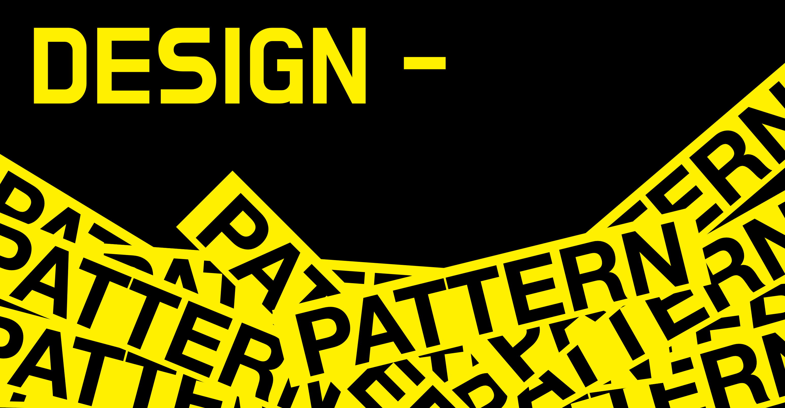

# 자바 디자인 패턴
   

# 🕹 생성 패턴 
## [1. 싱글톤](https://github.com/skyepodium/design-pattern/blob/main/creational/singleton.md)

## [2. 빌더](https://github.com/skyepodium/design-pattern/blob/main/creational/builder.md)